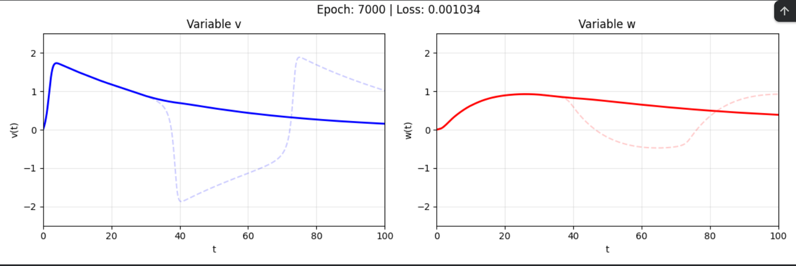

# Modelo de FitzHugh-Nagumo con PINNs

## Descripción
Este proyecto consiste en resolver el sistema de ecuaciones acopladas del modelo de FitzHugh-Nagumo utilizando Physics-Informed Neural Networks (PINNs).

## Modelo y Flujo (PyTorch)
- **Estructura del Modelo**: Se implementa una red neuronal profunda utilizando PyTorch (`torch.nn.Module`).
- **Función de Activación**: Se experimentó con diversas funciones de activación, concluyendo que `tanh` ofreció los mejores resultados.
- **Función de Pérdida**: Se compone de la pérdida de las ecuaciones diferenciales (EDO) y la pérdida asociada a las condiciones iniciales/fronteras.
- **Optimizador**: Se utilizan optimizadores típicos (como Adam o L-BFGS) para minimizar la pérdida conjunta.

## Notas y Resultados
- No se logró una buena simulación utilizando únicamente la pérdida de las ecuaciones y la condición inicial para un tiempo extenso ($T = 100$).
- Sin embargo, para tiempos inferiores ($T < 10$), el resultado de la simulación fue perfecto.
- Se implementó la técnica de *time marching* con la intención de mejorar los resultados a largo plazo, aunque no se obtuvieron grandes resultados.

## Comparación

