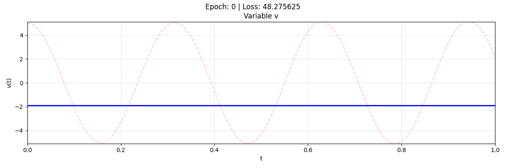

# Oscilador Armónico con PINNs

## Descripción
Este es un modelo de prueba diseñado para comprender y verificar cómo afecta el tamaño del dominio temporal al entrenamiento de un modelo PINN.

## Modelo y Flujo (PyTorch)
- **Estructura del Modelo**: Red neuronal en PyTorch (`torch.nn.Module`) que mapea el tiempo $t$ a la posición $x$.
- **Función de Pérdida**: Se evalúan los residuos de la ecuación diferencial del oscilador y la condición inicial.
- **Entrenamiento**: El modelo se entrena minimizando la pérdida en los puntos de colocación temporales utilizando un optimizador.

## Notas y Resultados
- Se verificó la necesidad de tener un dominio temporal inferior a 1 para que la simulación sea exitosa.
- **Razón**: Esto se debe a que la pérdida asociada a la condición inicial (ic) tiene un impacto fuerte alrededor de dicho punto ($t=0$). A medida que evaluamos puntos más lejanos en el tiempo, la influencia e impacto de la condición inicial se debilita considerablemente.

## Animación

